# Logical ERD Overview

Version: 0.1  
Date: 2026-06-30  
Status: Draft for review

## 1. Purpose

Cross-phase logical data model for eHRM. Detailed phase ERDs live in `01..04` files.

## 2. Conventions

- Tables: `snake_case`, plural.
- PK: `id` UUID.
- FK: `{entity}_id` UUID.
- Audit columns: `created_at`, `updated_at`, `created_by`, `updated_by` where needed.
- Temporal: `effective_from`, `effective_to`.
- Soft delete only where reversible deletion is required.
- JSONB only for flexible payloads, audit snapshots, integration payloads.
- Money: `numeric(18,2)`.
- Timestamp: `timestamptz`.

## 3. Logical ERD

```mermaid
erDiagram
  USERS ||--o{ USER_ROLES : has
  ROLES ||--o{ ROLE_PERMISSIONS : grants
  USERS ||--o{ DATA_SCOPE_ASSIGNMENTS : scoped
  USERS }o--o| EMPLOYEES : linked_to

  BRANCHES ||--o{ DEPARTMENTS : contains
  DEPARTMENTS ||--o{ DEPARTMENTS : parent_of
  POSITIONS ||--o{ EMPLOYEES : held_by
  EMPLOYEES ||--o{ EMPLOYEE_CONTRACTS : has
  EMPLOYEES ||--o{ EMPLOYEE_DOCUMENTS : has
  EMPLOYEES ||--o{ EMPLOYEE_HISTORY : tracks
  EMPLOYEES ||--o{ EMPLOYEE_REPORTING_LINES : reports

  EMPLOYEES ||--o{ ATTENDANCE_RAW_LOGS : produced
  EMPLOYEES ||--o{ ATTENDANCE_TIMESHEETS : recorded
  ATTENDANCE_TIMESHEETS ||--o{ ATTENDANCE_RAW_LOGS : calculated_from
  SHIFT_TEMPLATES ||--o{ SHIFT_ASSIGNMENTS : template_for
  ATTENDANCE_TIMESHEETS }o--|| SHIFT_ASSIGNMENTS : scheduled

  EMPLOYEES ||--o{ LEAVE_BALANCES : accrues
  EMPLOYEES ||--o{ LEAVE_REQUESTS : submits
  LEAVE_TYPES ||--o{ LEAVE_REQUESTS : classifies
  LEAVE_TYPES ||--o{ LEAVE_BALANCES : defines
  LEAVE_REQUESTS ||--o| WORKFLOW_REQUESTS : routed

  WORKFLOW_TEMPLATES ||--o{ WORKFLOW_REQUESTS : instantiates
  WORKFLOW_REQUESTS ||--o{ WORKFLOW_ACTIONS : tracks

  PAYROLL_PERIODS ||--o{ PAYROLL_RUNS : scheduled
  PAYROLL_RUNS ||--o{ PAYROLL_ENTRIES : contains
  PAYROLL_ENTRIES ||--o| PAYSLIPS : produces
  EMPLOYEES ||--o{ PAYROLL_ENTRIES : paid_via
  PAYROLL_ENTRIES ||--o{ PAYROLL_ADJUSTMENTS : adjusted_by

  RECRUITMENT_REQUISITIONS ||--o{ CANDIDATES : receives
  CANDIDATES ||--o{ INTERVIEWS : evaluated
  CANDIDATES ||--o| OFFERS : receives
  CANDIDATES }o--o| EMPLOYEES : converted_to

  EMPLOYEES ||--o| ONBOARDING_PLANS : onboarded_via
  EMPLOYEES ||--o| OFFBOARDING_REQUESTS : exited_via
  PERFORMANCE_CYCLES ||--o{ PERFORMANCE_REVIEWS : defines
  EMPLOYEES ||--o{ PERFORMANCE_REVIEWS : reviewed
  TRAINING_COURSES ||--o{ TRAINING_SESSIONS : session_of
  TRAINING_SESSIONS ||--o{ TRAINING_ENROLLMENTS : enrolled
  EMPLOYEES ||--o{ TRAINING_ENROLLMENTS : attends
  ASSET_ITEMS ||--o{ ASSET_ASSIGNMENTS : lifecycle
  EMPLOYEES ||--o{ ASSET_ASSIGNMENTS : issued_to

  USERS ||--o{ AUDIT_LOGS : acts
  LOOKUP_GROUPS ||--o{ LOOKUP_VALUES : classifies

  IDENTITY_PROVIDERS ||--o{ FEDERATED_IDENTITIES : maps
  USERS ||--o{ FEDERATED_IDENTITIES : external_subject
  INTEGRATION_ENDPOINTS ||--o{ INTEGRATION_JOBS : runs
  MOBILE_DEVICES ||--o{ MOBILE_SESSIONS : owns
  USERS ||--o{ MOBILE_SESSIONS : authenticates
  ANALYTICS_DEFINITIONS ||--o{ ANALYTICS_SNAPSHOTS : materialized
  RETENTION_POLICIES ||--o{ RETENTION_TARGETS : applies
```

## 4. Bounded Context Ownership

| BC | Key Tables |
| --- | --- |
| Identity & Access | users, roles, role_permissions, user_roles, data_scope_assignments |
| Organization | branches, departments, positions |
| Employee Master | employees, employee_contracts, employee_documents, employee_history, employee_reporting_lines |
| Configuration | lookup_groups, lookup_values, system_settings, code_generation_rules |
| Audit | audit_logs |
| Attendance | attendance_raw_logs, attendance_timesheets, attendance_adjustment_requests, attendance_periods |
| Shift | shift_templates, shift_assignments |
| Leave | leave_types, leave_policies, leave_requests, leave_balances |
| Workflow | workflow_templates, workflow_requests, workflow_actions |
| Notification | notification_templates, notification_messages, user_notification_preferences |
| Payroll | payroll_periods, payroll_runs, payroll_entries, payslips, payroll_adjustments, payroll_components |
| Reporting | report_definitions, report_runs |
| Recruitment | recruitment_requisitions, candidates, interviews, offers |
| Onboarding | onboarding_templates, onboarding_plans, onboarding_tasks |
| Offboarding | offboarding_requests, offboarding_plans, offboarding_tasks, final_clearances |
| Performance | performance_cycles, performance_reviews, goals, competency_templates |
| Training | training_courses, training_sessions, training_enrollments, training_results |
| Asset | asset_items, asset_assignments, asset_returns |
| Enterprise Identity | identity_providers, federated_identities, mfa_policies, session_controls |
| Integration Hub | integration_endpoints, integration_credentials, integration_jobs, webhook_subscriptions |
| Mobile Gateway | mobile_devices, mobile_sessions, push_subscriptions |
| Analytics | analytics_definitions, analytics_snapshots, analytics_report_runs |
| Compliance | retention_policies, retention_targets, masking_policies, audit_evidence_packages, data_export_requests |
| Operations | background_job_monitors, archive_batches, backup_runs, disaster_recovery_drills |

## 5. Cross-Context Reference Principles

- Cross-context links use stable UUID references.
- Employee Master does not mutate Organization.
- Identity references Employee via `employee_id`; it does not own profile.
- Attendance, Leave, Payroll, Training, Asset reference `employee_id`.
- Reporting and Analytics read from many contexts but own derived outputs only.
- Notification subscribes to events; no direct business ownership.

## 6. Temporal and Archival Strategy

- Effective dating: `employee_history`, `employee_contracts`, `shift_assignments`, `employee_reporting_lines`.
- Partition candidates: `audit_logs` yearly, `attendance_raw_logs` monthly, `payroll_entries` by period when large.
- Archive candidates: integration jobs after 90 days, raw attendance logs after operational window, generated reports after retention window.
