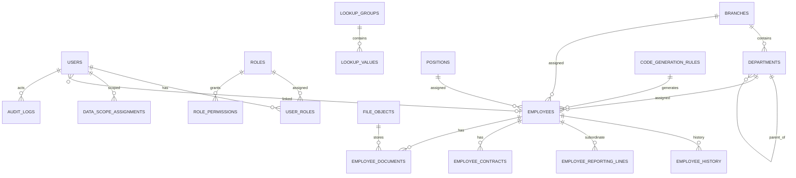

# Phase 1 ERD — Core Platform

Version: 0.1  
Date: 2026-06-30  
Status: Draft for review

## 1. Scope

Covers Identity & Access, Organization, Employee Master, Contract, Document, Configuration, and Audit.

## 2. Mermaid ERD

## 3. Table Catalog

| Table | Owner BC | Purpose |
| --- | --- | --- |
| users | Identity | Login account. |
| roles | Identity | Role catalog. |
| permissions | Identity | Permission catalog. |
| role_permissions | Identity | Role permission mapping. |
| user_roles | Identity | User role assignment. |
| data_scope_assignments | Identity | Self/manager/department/branch/all-company scope. |
| branches | Organization | Branch/office. |
| departments | Organization | Department tree. |
| positions | Organization | Job title/grade. |
| employees | Employee | Employee master profile and current assignment. |
| employee_history | Employee | Effective-dated employee changes. |
| employee_reporting_lines | Employee | Manager relationship history. |
| employee_contracts | Employee | Contract lifecycle. |
| employee_documents | Employee | HR document metadata. |
| file_objects | Employee | MinIO object descriptor. |
| lookup_groups | Configuration | Lookup categories. |
| lookup_values | Configuration | Lookup values. |
| code_generation_rules | Configuration | Employee/contract number rules. |
| system_settings | Configuration | Non-secret settings. |
| audit_logs | Audit | Immutable action log. |

## 4. Key Tables

### users

Columns:

- `id` PK
- `employee_id` FK nullable → `employees.id`
- `name`
- `email`
- `password_hash`
- `status`
- `last_login_at`
- `created_at`, `updated_at`

Constraints/indexes:

- unique `email`
- index `employee_id`
- index `status`

Delete policy: disable only; no physical delete.

### roles / role_permissions / user_roles

`permissions`: `id`, `code`, `module`, `action`, `description`, `active`.

`roles`: `id`, `code`, `name`, `description`, `active`.

`role_permissions`: `id`, `role_id`, `permission_code`, `created_at`.

`user_roles`: `id`, `user_id`, `role_id`, `assigned_by`, `assigned_at`, `revoked_at`.

Constraints/indexes:

- unique `permissions.code`
- unique `roles.code`
- unique `role_permissions(role_id, permission_code)`
- unique active `user_roles(user_id, role_id)` where `revoked_at is null`

### data_scope_assignments

Columns:

- `id` PK
- `user_id` FK → `users.id`
- `scope_type` (`self`, `direct_reports`, `department`, `branch`, `all_company`)
- `branch_id` FK nullable → `branches.id`
- `department_id` FK nullable → `departments.id`
- `effective_from`, `effective_to`

Indexes:

- `user_id, scope_type`
- `branch_id`
- `department_id`

### branches

Columns: `id`, `code`, `name`, `address`, `active`, timestamps.

Constraints/indexes:

- unique `code`
- index `active`

### departments

Columns:

- `id` PK
- `branch_id` FK → `branches.id`
- `parent_id` FK nullable → `departments.id`
- `code`, `name`, `active`

Constraints/indexes:

- unique `(parent_id, code)`
- index `branch_id`
- index `parent_id`
- app-level no-cycle invariant

### positions

Columns: `id`, `code`, `name`, `grade`, `active`, timestamps.

Constraints/indexes:

- unique `code`
- index `active`

### employees

Columns:

- `id` PK
- `employee_code`
- `full_name`
- `dob`, `gender`
- `personal_email`, `work_email`, `phone`
- `address`
- `branch_id` FK → `branches.id`
- `department_id` FK → `departments.id`
- `position_id` FK → `positions.id`
- `manager_id` FK nullable → `employees.id`
- `hire_date`
- `employment_type`
- `status`
- timestamps

Constraints/indexes:

- unique `employee_code`
- unique nullable `work_email`
- index `branch_id, department_id`
- index `manager_id`
- index `status`

### employee_history

Columns:

- `id` PK
- `employee_id` FK → `employees.id`
- `change_type`
- `old_value` JSONB
- `new_value` JSONB
- `effective_date`
- `reason`
- `changed_by` FK → `users.id`
- `created_at`

Indexes:

- `employee_id, effective_date`
- `change_type`

Delete policy: append-only.

### employee_reporting_lines

Columns: `id`, `employee_id`, `manager_id`, `line_type`, `effective_from`, `effective_to`, timestamps.

Constraints/indexes:

- index `employee_id, effective_from`
- index `manager_id`
- app-level no-cycle invariant

### employee_contracts

Columns:

- `id` PK
- `employee_id` FK
- `contract_number`
- `contract_type_id` FK → `lookup_values.id`
- `start_date`, `end_date`, `sign_date`
- `status`
- `predecessor_contract_id` FK nullable → `employee_contracts.id`
- `file_object_id` FK nullable → `file_objects.id`

Constraints/indexes:

- unique `contract_number`
- index `employee_id, status`
- index `end_date`
- exclusion/validation for overlapping active contracts in app or DB constraint later

### employee_documents / file_objects

`file_objects`: `id`, `disk`, `bucket`, `object_key`, `original_name`, `mime_type`, `size`, `checksum`, `uploaded_by`, timestamps.

`employee_documents`: `id`, `employee_id`, `document_type_id`, `file_object_id`, `issue_date`, `expiry_date`, `status`, timestamps.

Indexes:

- `employee_documents(employee_id, document_type_id)`
- `employee_documents(expiry_date)`
- unique `file_objects(bucket, object_key)`

### configuration tables

`lookup_groups`: unique `code`.

`lookup_values`: `lookup_group_id`, `code`, `name`, `sort_order`, `active`; unique `(lookup_group_id, code)`.

`code_generation_rules`: `entity_type`, `pattern`, `prefix`, `sequence_padding`, `next_number`, `active`; unique active `entity_type`.

`system_settings`: unique `key`; no secrets.

### audit_logs

Columns:

- `id` PK
- `actor_user_id` FK nullable
- `action`
- `module`
- `entity_type`
- `entity_id`
- `before_payload` JSONB
- `after_payload` JSONB
- `ip_address`
- `user_agent`
- `result`
- `occurred_at`

Indexes:

- `actor_user_id, occurred_at`
- `module, entity_type, entity_id`
- `occurred_at`

Partition candidate: yearly.

## 5. Notes

- Employee profile is the center of Phase 1.
- Contract and document are separate tables/aggregates to avoid an oversized employee row/model.
- Audit is append-only.
- MinIO file storage is represented by `file_objects` metadata only.

## 6. Company Singleton Note

Phase 1 is a single-enterprise installation. Company profile is treated as singleton configuration (`system_settings`) rather than a full `companies` aggregate/table. If multi-company support is introduced later, promote it to an explicit `companies` table and migrate branch ownership.
