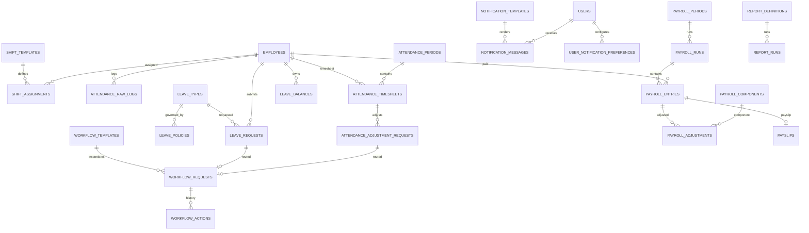

# Phase 2 ERD — Workforce Operations

Version: 0.1  
Date: 2026-06-30  
Status: Draft for review

## 1. Scope

Covers Attendance, Shift, Leave, Workflow, Notification, Payroll, and Reporting.

## 2. Mermaid ERD

## 3. Table Catalog

| Table | Owner BC | Purpose |
| --- | --- | --- |
| shift_templates | Shift | Shift rules. |
| shift_assignments | Shift | Employee/department shift schedule. |
| attendance_raw_logs | Attendance | Raw check-in/out/import/device data. |
| attendance_timesheets | Attendance | Calculated daily attendance. |
| attendance_adjustment_requests | Attendance | Manual correction request. |
| attendance_periods | Attendance | Monthly attendance close period. |
| leave_types | Leave | Leave type catalog. |
| leave_policies | Leave | Leave accrual/carry/expiry rules. |
| leave_requests | Leave | Employee leave request. |
| leave_balances | Leave | Per employee leave balance. |
| workflow_templates | Workflow | Approval template. |
| workflow_requests | Workflow | Approval instance. |
| workflow_actions | Workflow | Approval history. |
| notification_templates | Notification | Message templates. |
| notification_messages | Notification | Delivered/queued messages. |
| user_notification_preferences | Notification | User channel preferences. |
| payroll_periods | Payroll | Payroll period. |
| payroll_runs | Payroll | Calculation run. |
| payroll_entries | Payroll | Employee payroll result. |
| payroll_components | Payroll | Component catalog. |
| payroll_adjustments | Payroll | Payroll corrections. |
| payslips | Payroll | Payslip metadata/file. |
| report_definitions | Reporting | Report catalog. |
| report_runs | Reporting | Async report execution. |

## 4. Key Tables

### shift_templates

Columns: `id`, `code`, `name`, `start_time`, `end_time`, `is_overnight`, `break_minutes`, `late_tolerance_minutes`, `overtime_rules` JSONB, `flexibility_rules` JSONB, `active`.

Constraints/indexes: unique `code`, index `active`.

### shift_assignments

Columns: `id`, `employee_id` nullable, `department_id` nullable, `shift_template_id`, `effective_from`, `effective_to`, `assignment_type`.

Indexes: `employee_id, effective_from`, `department_id, effective_from`, `shift_template_id`.

Constraint: exactly one of `employee_id` or `department_id`.

### attendance_raw_logs

Columns: `id`, `employee_id`, `source`, `event_type`, `event_time`, `geo_point` JSONB nullable, `payload` JSONB, `created_at`.

Indexes: `employee_id, event_time`, `source, event_time`.

Partition candidate: monthly.

### attendance_timesheets

Columns: `id`, `attendance_period_id`, `employee_id`, `work_date`, `shift_assignment_id`, `expected_minutes`, `worked_minutes`, `late_minutes`, `early_leave_minutes`, `overtime_minutes`, `leave_type_id`, `result_status`, `calculation_run_id`, timestamps.

Constraints/indexes:

- unique `(employee_id, work_date, shift_assignment_id)`
- index `attendance_period_id`
- index `employee_id, work_date`

### attendance_adjustment_requests

Columns: `id`, `employee_id`, `attendance_timesheet_id`, `reason`, `evidence_file_object_id`, `status`, `workflow_request_id`, timestamps.

Indexes: `employee_id, status`, `workflow_request_id`.

### attendance_periods

Columns: `id`, `period_code`, `start_date`, `end_date`, `status`, `closed_by`, `closed_at`.

Constraints: unique `period_code`.

### leave_types / leave_policies

`leave_types`: `id`, `code`, `name`, `balance_tracked`, `active`.

`leave_policies`: `id`, `leave_type_id`, `accrual_rule` JSONB, `carry_forward_rule` JSONB, `expiry_rule` JSONB, `allow_negative`, `active`.

Constraints: unique `leave_types.code`, unique active policy per leave type.

### leave_requests

Columns: `id`, `employee_id`, `leave_type_id`, `start_at`, `end_at`, `duration_unit`, `duration_value`, `reason`, `status`, `workflow_request_id`, timestamps.

Indexes: `employee_id, start_at`, `leave_type_id`, `status`.

### leave_balances

Columns: `id`, `employee_id`, `leave_type_id`, `period_year`, `opening_balance`, `accrued`, `used`, `carried_over`, `expired`, `remaining`.

Constraints: unique `(employee_id, leave_type_id, period_year)`.

### workflow tables

`workflow_templates`: `id`, `module`, `name`, `steps` JSONB, `conditions` JSONB, `active`.

`workflow_requests`: `id`, `workflow_template_id`, `subject_type`, `subject_id`, `initiator_user_id`, `current_step`, `status`, timestamps.

`workflow_actions`: `id`, `workflow_request_id`, `step`, `actor_user_id`, `action`, `comment`, `acted_at`, `metadata` JSONB.

Indexes: `workflow_requests(subject_type, subject_id)`, `workflow_requests(status)`, `workflow_actions(workflow_request_id, acted_at)`.

### notification tables

`notification_templates`: `id`, `code`, `channel`, `subject_template`, `body_template`, `active`.

`notification_messages`: `id`, `template_id`, `recipient_user_id`, `channel`, `payload` JSONB, `state`, `sent_at`, `error`.

`user_notification_preferences`: `id`, `user_id`, `channel`, `enabled`.

### payroll tables

`payroll_periods`: `id`, `period_code`, `start_date`, `end_date`, `status`, `cutoff_date`.

`payroll_runs`: `id`, `payroll_period_id`, `run_type`, `status`, `formula_version`, `started_at`, `completed_at`.

`payroll_entries`: `id`, `payroll_run_id`, `employee_id`, `base_salary_snapshot` JSONB, `component_breakdown` JSONB, `gross`, `deductions`, `tax`, `insurance`, `net`, `attendance_basis` JSONB.

`payroll_components`: `id`, `code`, `name`, `component_type`, `taxable`, `active`.

`payroll_adjustments`: `id`, `payroll_entry_id`, `payroll_component_id`, `amount`, `reason`, `created_by`, timestamps.

`payslips`: `id`, `payroll_entry_id`, `employee_id`, `file_object_id`, `published_at`, `access_policy` JSONB.

Indexes: `payroll_periods.period_code` unique, `payroll_entries(employee_id, payroll_run_id)`, `payslips(employee_id, published_at)`.

### reporting tables

`report_definitions`: `id`, `code`, `name`, `module`, `query_config` JSONB, `active`.

`report_runs`: `id`, `report_definition_id`, `requested_by`, `status`, `filters` JSONB, `file_object_id`, timestamps.

## 5. Notes

- Payroll consumes closed attendance periods.
- Workflow is generic by `subject_type/subject_id`.
- Payroll locked status is domain-enforced; DB should still index `status`.
