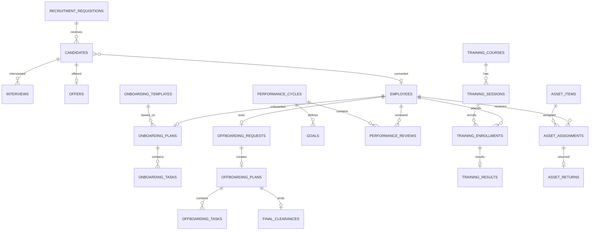

# Phase 3 ERD — Talent Lifecycle

Version: 0.1  
Date: 2026-06-30  
Status: Draft for review

## 1. Scope

Covers Recruitment, Onboarding, Offboarding, Performance, Training, and Asset.

## 2. Mermaid ERD

## 3. Table Catalog

| Table | Owner BC | Purpose |
| --- | --- | --- |
| recruitment_requisitions | Recruitment | Hiring request. |
| candidates | Recruitment | Candidate master. |
| interviews | Recruitment | Interview schedule/result header. |
| offers | Recruitment | Offer to candidate. |
| onboarding_templates | Onboarding | Template task set. |
| onboarding_plans | Onboarding | Per-hire onboarding plan. |
| onboarding_tasks | Onboarding | Individual onboarding tasks. |
| offboarding_requests | Offboarding | Exit request. |
| offboarding_plans | Offboarding | Exit plan. |
| offboarding_tasks | Offboarding | Exit tasks. |
| final_clearances | Offboarding | Final clearance record. |
| performance_cycles | Performance | Review cycle. |
| goals | Performance | Goal definition/assignment. |
| performance_reviews | Performance | Employee review. |
| competency_templates | Performance | Competency/scoring template. |
| training_courses | Training | Course catalog. |
| training_sessions | Training | Session instance. |
| training_enrollments | Training | Employee enrollment. |
| training_results | Training | Completion/result. |
| asset_items | Asset | Inventory item. |
| asset_assignments | Asset | Employee custody. |
| asset_returns | Asset | Return record. |

## 4. Key Tables

### recruitment_requisitions

Columns: `id`, `department_id`, `position_id`, `headcount`, `reason`, `status`, `workflow_request_id`, `opened_at`, `closed_at`, timestamps.

Indexes: `department_id`, `position_id`, `status`.

### candidates

Columns: `id`, `full_name`, `email`, `phone`, `source`, `cv_file_object_id`, `status`, `primary_requisition_id`, timestamps.

Constraints/indexes:

- index `email`
- index `phone`
- index `status`
- duplicate prevention by app rules + candidate merge path

### interviews

Columns: `id`, `candidate_id`, `requisition_id`, `scheduled_at`, `status`, `scorecards` JSONB, timestamps.

Indexes: `candidate_id`, `scheduled_at`, `status`.

### offers

Columns: `id`, `candidate_id`, `requisition_id`, `terms` JSONB, `status`, `accepted_at`, `rejected_at`, timestamps.

Constraint: unique active offer per candidate/requisition.

### onboarding tables

`onboarding_templates`: `id`, `code`, `name`, `rules` JSONB, `active`.

`onboarding_plans`: `id`, `employee_id`, `candidate_id`, `template_id`, `start_date`, `status`, timestamps.

`onboarding_tasks`: `id`, `onboarding_plan_id`, `owner_type`, `owner_id`, `task_type`, `due_date`, `status`, `proof_file_object_id`, timestamps.

Indexes: `onboarding_tasks(onboarding_plan_id, status)`, `owner_id, status`.

### offboarding tables

`offboarding_requests`: `id`, `employee_id`, `reason`, `requested_last_working_date`, `approved_last_working_date`, `status`, `workflow_request_id`, timestamps.

`offboarding_plans`: `id`, `offboarding_request_id`, `status`, timestamps.

`offboarding_tasks`: `id`, `offboarding_plan_id`, `owner_type`, `owner_id`, `task_type`, `due_date`, `status`, timestamps.

`final_clearances`: `id`, `employee_id`, `offboarding_plan_id`, `cleared_at`, `cleared_by`, `final_payroll_notes`, timestamps.

Indexes: `offboarding_requests(employee_id, status)`, `offboarding_tasks(offboarding_plan_id, status)`.

### performance tables

`performance_cycles`: `id`, `code`, `name`, `start_date`, `end_date`, `status`, `scoring_rules` JSONB.

`goals`: `id`, `performance_cycle_id`, `employee_id` nullable, `title`, `weight`, `target_value`, `status`.

`performance_reviews`: `id`, `performance_cycle_id`, `employee_id`, `self_assessment` JSONB, `manager_assessment` JSONB, `score`, `status`, `finalized_at`.

`competency_templates`: `id`, `code`, `name`, `rules` JSONB, `active`.

Indexes: `performance_reviews(employee_id, performance_cycle_id)`, `performance_cycles(status)`.

### training tables

`training_courses`: `id`, `code`, `name`, `description`, `active`.

`training_sessions`: `id`, `training_course_id`, `starts_at`, `ends_at`, `capacity`, `status`.

`training_enrollments`: `id`, `training_session_id`, `employee_id`, `status`, `enrolled_at`.

`training_results`: `id`, `training_enrollment_id`, `result`, `score`, `certificate_file_object_id`, `completed_at`.

Constraints: unique `(training_session_id, employee_id)`.

### asset tables

`asset_items`: `id`, `asset_code`, `asset_type`, `serial_number`, `condition`, `status`, timestamps.

`asset_assignments`: `id`, `asset_item_id`, `employee_id`, `issued_at`, `expected_return_at`, `condition_on_issue`, `status`, timestamps.

`asset_returns`: `id`, `asset_assignment_id`, `returned_at`, `condition_on_return`, `notes`, `settlement_amount`.

Constraints/indexes:

- unique `asset_code`
- unique active assignment per asset
- index `employee_id, status`

## 5. Notes

- Candidate → Employee conversion should preserve candidate history, not overwrite it.
- Onboarding/Offboarding plans are workflow-heavy tables.
- Asset assignment integrates with final clearance but remains its own BC/table set.
