# Phase 4 ERD — Enterprise Extensions

Version: 0.1  
Date: 2026-06-30  
Status: Draft for review

## 1. Scope

Covers Enterprise Identity, Integration Hub, Mobile Gateway, Analytics, Compliance, and Operations.

## 2. Mermaid ERD

```mermaid
erDiagram
  IDENTITY_PROVIDERS ||--o{ FEDERATED_IDENTITIES : maps
  USERS ||--o{ FEDERATED_IDENTITIES : linked
  MFA_POLICIES ||--o{ SESSION_CONTROLS : governs

  INTEGRATION_ENDPOINTS ||--o{ INTEGRATION_CREDENTIALS : secures
  INTEGRATION_ENDPOINTS ||--o{ INTEGRATION_JOBS : executes
  INTEGRATION_ENDPOINTS ||--o{ WEBHOOK_SUBSCRIPTIONS : publishes

  MOBILE_DEVICES ||--o{ MOBILE_SESSIONS : owns
  MOBILE_DEVICES ||--o{ PUSH_SUBSCRIPTIONS : subscribes
  USERS ||--o{ MOBILE_SESSIONS : uses

  ANALYTICS_DEFINITIONS ||--o{ ANALYTICS_SNAPSHOTS : materializes
  ANALYTICS_DEFINITIONS ||--o{ ANALYTICS_REPORT_RUNS : executes

  RETENTION_POLICIES ||--o{ RETENTION_TARGETS : targets
  MASKING_POLICIES ||--o{ DATA_EXPORT_REQUESTS : protects
  AUDIT_EVIDENCE_PACKAGES ||--o{ DATA_EXPORT_REQUESTS : bundles

  BACKGROUND_JOB_MONITORS ||--o{ ARCHIVE_BATCHES : tracks
  BACKGROUND_JOB_MONITORS ||--o{ BACKUP_RUNS : tracks
  BACKGROUND_JOB_MONITORS ||--o{ DISASTER_RECOVERY_DRILLS : tracks
```

## 3. Table Catalog

| Table | Owner BC | Purpose |
| --- | --- | --- |
| identity_providers | Enterprise Identity | SSO provider config metadata. |
| federated_identities | Enterprise Identity | External subject ↔ local user map. |
| mfa_policies | Enterprise Identity | MFA requirement policy. |
| session_controls | Enterprise Identity | Session revocation/visibility. |
| integration_endpoints | Integration | External system endpoint. |
| integration_credentials | Integration | Credential metadata. |
| integration_jobs | Integration | Async integration execution. |
| webhook_subscriptions | Integration | Outbound event delivery config. |
| mobile_devices | Mobile | Registered device. |
| mobile_sessions | Mobile | Mobile session/token tracking. |
| push_subscriptions | Mobile | Push token registration. |
| analytics_definitions | Analytics | Metric/report definition. |
| analytics_snapshots | Analytics | Materialized metric snapshot. |
| analytics_report_runs | Analytics | Async report generation. |
| retention_policies | Compliance | Data retention policy. |
| retention_targets | Compliance | Policy target mapping. |
| masking_policies | Compliance | Sensitive field masking rules. |
| audit_evidence_packages | Compliance | Audit evidence bundle. |
| data_export_requests | Compliance | Sensitive export request. |
| background_job_monitors | Operations | Operational job visibility. |
| archive_batches | Operations | Archive execution. |
| backup_runs | Operations | Backup evidence. |
| disaster_recovery_drills | Operations | DR exercise evidence. |

## 4. Key Tables

### enterprise identity tables

`identity_providers`: `id`, `provider_type`, `issuer`, `client_id`, `mapping_rules` JSONB, `active`.

`federated_identities`: `id`, `identity_provider_id`, `user_id`, `external_subject`, `last_login_at`.

`mfa_policies`: `id`, `name`, `scope_rules` JSONB, `active`.

`session_controls`: `id`, `user_id`, `session_identifier`, `revoked_at`, `revoked_by`, `metadata` JSONB.

Constraints/indexes:

- unique `(identity_provider_id, external_subject)`
- index `user_id`
- index `revoked_at`

### integration tables

`integration_endpoints`: `id`, `code`, `system_type`, `direction`, `transport`, `active`.

`integration_credentials`: `id`, `integration_endpoint_id`, `credential_type`, `secret_ref`, `active`.

`integration_jobs`: `id`, `integration_endpoint_id`, `job_type`, `payload_ref`, `status`, `attempt_count`, `last_error`, `started_at`, `completed_at`.

`webhook_subscriptions`: `id`, `integration_endpoint_id`, `event_type`, `target_url`, `active`.

Indexes: `integration_jobs(status, started_at)`, `integration_endpoint_id`.

### mobile tables

`mobile_devices`: `id`, `user_id`, `device_identifier`, `platform`, `status`, `registered_at`.

`mobile_sessions`: `id`, `mobile_device_id`, `user_id`, `token_hash`, `expires_at`, `revoked_at`.

`push_subscriptions`: `id`, `mobile_device_id`, `provider`, `token`, `active`.

Constraints: unique `device_identifier`, unique active push token.

### analytics tables

`analytics_definitions`: `id`, `code`, `name`, `query_config` JSONB, `active`.

`analytics_snapshots`: `id`, `analytics_definition_id`, `period_key`, `snapshot_payload` JSONB, `generated_at`.

`analytics_report_runs`: `id`, `analytics_definition_id`, `requested_by`, `status`, `filters` JSONB, `file_object_id`, timestamps.

### compliance tables

`retention_policies`: `id`, `code`, `name`, `rule_config` JSONB, `active`.

`retention_targets`: `id`, `retention_policy_id`, `target_table`, `conditions` JSONB.

`masking_policies`: `id`, `code`, `field_scope`, `rule_config` JSONB, `active`.

`audit_evidence_packages`: `id`, `code`, `requested_by`, `scope_config` JSONB, `file_object_id`, `generated_at`.

`data_export_requests`: `id`, `requested_by`, `target_scope`, `status`, `reason`, `file_object_id`, timestamps.

Indexes: `status`, `requested_by`, `generated_at`.

### operations tables

`background_job_monitors`: `id`, `job_name`, `status`, `last_started_at`, `last_completed_at`, `metrics` JSONB.

`archive_batches`: `id`, `target_table`, `period_key`, `status`, `started_at`, `completed_at`, `summary` JSONB.

`backup_runs`: `id`, `backup_type`, `status`, `started_at`, `completed_at`, `evidence` JSONB.

`disaster_recovery_drills`: `id`, `scenario`, `status`, `started_at`, `completed_at`, `evidence` JSONB.

## 5. Notes

- Phase 4 tables extend control-plane capability; they do not own core HR facts.
- Secrets stay outside business tables; store refs only.
- Analytics owns derived snapshots, never source-of-truth employee/payroll records.
