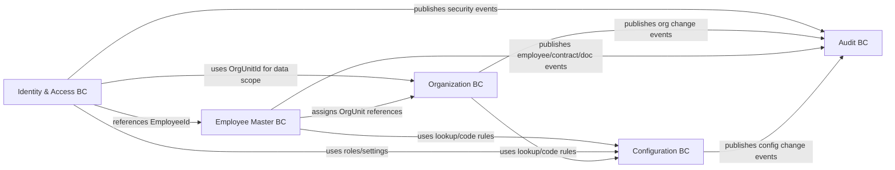

# Phase 1 DDD Domain Model Design

Version: 0.1  
Date: 2026-06-30  
Status: Draft for review

## 1. Introduction

### 1.1 Purpose

This document defines the Domain-Driven Design model for Phase 1 (Core Platform) of the eHRM system. It establishes subdomain classification, bounded contexts, aggregate boundaries, value objects, domain events, and application-layer shape.

Goals:

- Enforce Phase 1 invariants.
- Minimize aggregate coupling and contention.
- Support Phase 2 workflow and notification events without redesign.
- Keep DDD practical for Laravel 12 / PHP 8.4.

### 1.2 Scope

In scope:

- Strategic design for Phase 1.
- Tactical design for Phase 1 bounded contexts.
- Application-layer use cases.
- Laravel-friendly implementation guidance.

Out of scope:

- Attendance, Shift, Leave, Payroll (Phase 2).
- Recruitment, Onboarding, Offboarding, Performance, Training, Asset (Phase 3).
- SSO, Mobile, Advanced Analytics, Compliance extensions (Phase 4).
- Code-level class signatures or unnecessary factory/specification scaffolding.

### 1.3 References

- `docs/srs/00-enterprise-srs.md`
- `docs/srs/01-core-platform-srs.md`
- `docs/ROADMAP.md`
- `docs/ROADMAP_DETAIL_1.md`
- `docs/ROADMAP_DETAIL_2.md`

## 2. Strategic Design

### 2.1 Subdomain Classification

| Subdomain | Type | Rationale |
| --- | --- | --- |
| Employee Master | Core | High complexity, high business advantage; central HR data model. |
| Organization | Supporting | Required by all modules; mostly hierarchy/reference invariants. |
| Identity & Access | Supporting | Critical security boundary; largely platform-shaped policies. |
| Contract | Supporting | Business-meaningful, lifecycle/version driven. |
| Document | Generic | File storage pattern is generic; HR layer is metadata/access. |
| Configuration | Generic | Lookup, rule, setting management. |
| Audit | Generic | Append-only cross-module record. |

Modeling effort should concentrate on Employee Master while keeping every context clean enough for later phases.

### 2.2 Bounded Context Map



### 2.3 Context Integration Patterns

| Relationship | Pattern | Rule |
| --- | --- | --- |
| Employee Master → Organization | Customer / Supplier | Employee consumes active org references. |
| Identity & Access → Employee | Conformist | Identity stores `employee_id`; profile stays in Employee BC. |
| All → Audit | Published Language | Audit consumes domain/application events. |
| All → Configuration | Shared Kernel (read-only) | Config exposes stable lookup/code contracts. |

Inter-context references use stable identifiers only. No context mutates another context's aggregate directly.

## 3. Tactical Design — Identity & Access BC

### 3.1 Aggregates

- `User` (Aggregate Root)
- `Role` (Aggregate Root)

`Permission` is an Identity-owned reference catalog. It does not need its own rich aggregate in Phase 1; it is persisted as a catalog table or seed data and mapped through `role_permissions`.

### 3.2 User Aggregate

Owns:

- account identity
- login status
- role bindings
- data-scope assignments

Key attributes:

- `id`
- `employee_id` (optional reference)
- `name`
- `email`
- `password_hash`
- `status`
- `last_login_at`

Child entities / value objects:

- `RoleBinding`
- `DataScopeAssignment`
- `Email`
- `DataScope`

Invariants:

- Email must be unique across active users.
- Disabled users cannot authenticate.
- Disabling a user does not delete linked employee profile.
- Role bindings must reference active roles at assignment time.
- Role/scope changes must emit auditable events.

Domain behaviors:

- assign role
- revoke role
- grant data scope
- disable user
- record login attempt

Domain events:

- `UserCreated`
- `UserDisabled`
- `UserLoginSucceeded`
- `UserLoginFailed`
- `UserRoleAssigned`
- `UserRoleRevoked`
- `UserDataScopeGranted`

Repositories:

- `UserRepository`
- `RoleRepository`

## 4. Tactical Design — Organization BC

### 4.1 Aggregates

- `Branch` (Aggregate Root)
- `Department` (Aggregate Root)
- `Position` (Aggregate Root)

`Company` is a single-enterprise installation setting in Phase 1, not a multi-tenant root. It may be persisted as a singleton `system_settings` record or a small `company_profile` table later, but it is not a bounded-context aggregate in Phase 1.

### 4.2 Branch Aggregate

Key attributes:

- `id`
- `code`
- `name`
- `address`
- `active`

Invariants:

- Branch code is unique.
- Deactivated branches stay resolvable for historical employees.

### 4.3 Department Aggregate

Key attributes:

- `id`
- `code`
- `name`
- `parent_id`
- `branch_id`
- `active`

Invariants:

- Department hierarchy must have no cycles.
- Department code is unique within parent.
- Deactivated departments stay resolvable for history.

### 4.4 Position Aggregate

Key attributes:

- `id`
- `code`
- `name`
- `grade`
- `active`

Invariants:

- Position code is unique.
- Deactivated positions stay resolvable for historical employees.

Value objects:

- `OrgUnitId`
- `Address`

Domain events:

- `BranchCreated`
- `BranchDeactivated`
- `DepartmentCreated`
- `DepartmentMoved`
- `DepartmentDeactivated`
- `PositionCreated`
- `PositionDeactivated`

Repositories:

- `BranchRepository`
- `DepartmentRepository`
- `PositionRepository`

## 5. Tactical Design — Employee Master BC

Employee Master is the Phase 1 core domain. Aggregates are intentionally separated to prevent a giant `Employee` aggregate.

### 5.1 Aggregates

- `Employee` (Aggregate Root)
- `Contract` (Aggregate Root)
- `EmployeeDocument` (Aggregate Root)

`Contract` and `EmployeeDocument` reference `employee_id`; they are not child entities inside `Employee`.

### 5.2 Employee Aggregate

Owns:

- employee identity
- personal profile
- current employment snapshot
- lifecycle status
- employee history

Key attributes:

- `id`
- `employee_code`
- `full_name`
- `dob`
- `gender`
- `personal_email`
- `phone`
- `address`
- `status`

Child entities / value objects:

- `EmploymentSnapshot`
- `EmployeeHistory`
- `EmployeeCode`
- `PersonalName`
- `EmployeeStatus`
- `Address`

Lifecycle state machine:

```text
Draft -> Onboarding -> Probation -> Active -> Resigned -> Archived
Draft -> Active
Active -> Suspended -> Active
Active -> Resigned
Probation -> Resigned
```

Invariants:

- Employee code is unique.
- Status transition must follow the lifecycle state machine.
- Manager reference must be null or a valid active employee at assignment time.
- Branch, department, and position references must be active at assignment time.
- `EmployeeHistory` is append-only.

Domain behaviors:

- create profile
- update personal info
- change employment assignment
- change manager
- change lifecycle status
- link user account

Domain events:

- `EmployeeCreated`
- `EmployeePersonalInfoUpdated`
- `EmployeeEmploymentChanged`
- `EmployeeManagerChanged`
- `EmployeeStatusChanged`

Repository:

- `EmployeeRepository`

### 5.3 Contract Aggregate

Owns:

- contract lifecycle
- contract terms
- renewal linkage

Key attributes:

- `id`
- `employee_id`
- `contract_number`
- `contract_type`
- `start_date`
- `end_date`
- `sign_date`
- `status`
- `predecessor_contract_id`

Invariants:

- A definite/seasonal contract requires `end_date`.
- Renewal creates a successor contract and does not overwrite history.
- Overlapping active contracts for one employee are blocked unless policy explicitly allows.

Domain behaviors:

- create draft
- activate
- renew
- terminate
- cancel
- mark expired

Value objects:

- `ContractTerm`
- `DateRange`

Domain events:

- `ContractCreated`
- `ContractActivated`
- `ContractRenewed`
- `ContractExpired`
- `ContractTerminated`

Repository:

- `ContractRepository`

### 5.4 EmployeeDocument Aggregate

Owns:

- document metadata
- file descriptor reference
- expiry state
- document lifecycle

Key attributes:

- `id`
- `employee_id`
- `document_type`
- `category`
- `file_descriptor`
- `issue_date`
- `expiry_date`
- `status`

Invariants:

- Document metadata is committed only after MinIO object upload succeeds.
- Document types configured with expiry require `expiry_date`.
- Direct public file access is forbidden.

Domain behaviors:

- upload
- replace
- archive
- mark expired

Value objects:

- `DocumentDescriptor`

Domain events:

- `EmployeeDocumentUploaded`
- `EmployeeDocumentReplaced`
- `EmployeeDocumentExpired`

Repository:

- `EmployeeDocumentRepository`

### 5.5 Employee Master Domain Services

Use only these domain services in Phase 1:

- `EmployeeCodeGenerator`
- `EmployeeLifecyclePolicy`
- `ContractRenewalPolicy`

No generic `EmployeeService` is needed.

## 6. Tactical Design — Configuration BC

### 6.1 Aggregates

- `LookupGroup` (Aggregate Root)
- `CodeGenerationRule` (Aggregate Root)
- `SystemSetting` (Aggregate Root)

### 6.2 LookupGroup Aggregate

Owns lookup values for categories such as contract type, document type, gender, employment type, and status labels.

Invariants:

- Lookup group code is unique.
- Lookup value code is unique within group.
- Lookup values in use are deactivated, not deleted.

### 6.3 CodeGenerationRule Aggregate

Owns code generation for entities such as employee and contract.

Invariants:

- One active rule per entity type.
- Generated codes must be deterministic and unique.

### 6.4 SystemSetting Aggregate

Owns non-secret system settings.

Invariants:

- Setting key is unique.
- Secrets are not stored as plain settings.

Domain events:

- `LookupValueChanged`
- `CodeGenerationRuleChanged`
- `SystemSettingChanged`

Repositories:

- `LookupGroupRepository`
- `CodeGenerationRuleRepository`
- `SystemSettingRepository`

## 7. Tactical Design — Audit BC

`AuditLog` is an append-only record model, not a behavior-rich aggregate.

Key attributes:

- `id`
- `actor_user_id`
- `action`
- `module`
- `entity_type`
- `entity_id`
- `before_payload`
- `after_payload`
- `ip_address`
- `user_agent`
- `occurred_at`
- `result`

Rules:

- Audit records are never updated/deleted by application code.
- Sensitive secrets are filtered before write.
- Audit BC subscribes to domain/application events from all Phase 1 contexts.

Repository:

- `AuditLogRepository`

## 8. Application Layer Shape

### 8.1 Use Cases

Identity:

- `AssignUserRole`
- `RevokeUserRole`
- `GrantUserDataScope`
- `DisableUser`
- `AuthenticateUser`

Organization:

- `CreateBranch`
- `CreateDepartment`
- `MoveDepartment`
- `CreatePosition`

Employee:

- `CreateEmployee`
- `UpdateEmployeePersonalInfo`
- `TransferEmployee`
- `ChangeEmployeeManager`
- `ChangeEmployeeStatus`
- `LinkEmployeeToUser`
- `CreateContract`
- `ActivateContract`
- `RenewContract`
- `TerminateContract`
- `UploadEmployeeDocument`
- `ReplaceEmployeeDocument`

Configuration:

- `CreateLookupValue`
- `DeactivateLookupValue`
- `UpdateCodeGenerationRule`
- `UpdateSystemSetting`

### 8.2 Orchestration Rules

- Application service = one use case.
- Permission and data-scope checks happen before aggregate load/mutation.
- Aggregate enforces invariants.
- Repository persists aggregate.
- Domain events publish after transaction commit.
- Audit writes happen from event subscribers or explicit application events.

### 8.3 Transaction Boundaries

- Default: one aggregate per transaction.
- Cross-aggregate reactions use domain events.
- File upload: MinIO object succeeds first, then document metadata commits.
- Employee creation + initial history can be one transaction because history is child of Employee.

## 9. Laravel Implementation Guidance

### 9.1 Folder Shape

```text
app/
  Modules/
    Identity/
      Domain/
      Application/
      Infrastructure/
    Organization/
      Domain/
      Application/
      Infrastructure/
    Employee/
      Domain/
      Application/
      Infrastructure/
    Configuration/
      Domain/
      Application/
      Infrastructure/
    Audit/
      Domain/
      Application/
      Infrastructure/
```

### 9.2 Layer Rules

- Domain layer has no Laravel framework dependency.
- Application layer coordinates use cases and transactions.
- Infrastructure layer owns Eloquent, Redis, MinIO, queues, and framework adapters.
- HTTP controllers call application use cases.
- Policies/guards enforce permission/data scope at boundary.

### 9.3 Testing Boundaries

- Domain tests: pure PHP, no Laravel boot.
- Application tests: fake repositories + fake event bus.
- Infrastructure tests: PostgreSQL / Redis / MinIO integration.
- HTTP tests: Laravel feature tests against API contracts.

## 10. Deliberate Non-Goals

- No full CQRS in Phase 1.
- No event sourcing.
- No saga/process manager until workflow engine needs it.
- No generic `*Service` layer for every entity.
- No one-implementation interfaces beyond repository and infrastructure boundaries.

## 11. Acceptance

This DDD model is accepted when:

1. Every Phase 1 SRS module maps to one bounded context.
2. Every Phase 1 material state change emits a domain/application event.
3. Aggregates enforce listed invariants.
4. Aggregate boundaries avoid a giant Employee aggregate.
5. Laravel module structure maps 1:1 to bounded contexts.
6. Phase 2+ concerns do not leak into Phase 1 aggregates.
7. The model supports isolated domain tests and infrastructure integration tests.
