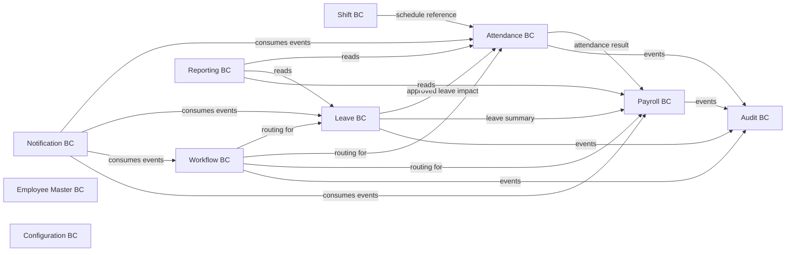

# Phase 2 DDD Domain Model Design — Workforce Operations

Version: 0.1  
Date: 2026-06-30  
Status: Draft for review

## 1. Introduction

### 1.1 Purpose

Defines the DDD model for Phase 2 (Workforce Operations). Phase 2 turns Phase 1 master data into daily operational HR flows: timekeeping, leave, approvals, notification, payroll, and reports.

### 1.2 Scope

In scope:

- Strategic context for workforce operations.
- Tactical design for new Phase 2 bounded contexts.
- Application-layer use cases.
- Cross-context event flow.

Out of scope:

- Recap of Phase 1 bounded contexts.
- Phase 3/4 domain modeling.

### 1.3 References

- `docs/superpowers/specs/2026-06-30-phase1-ddd-domain-model.md`
- `docs/srs/02-workforce-ops-srs.md`
- `docs/srs/00-enterprise-srs.md`

## 2. Strategic Design

### 2.1 Subdomain Classification

| Subdomain | Type | Rationale |
| --- | --- | --- |
| Payroll | Core | High complexity, high business value, integrates everything. |
| Attendance | Supporting | Provides critical inputs to payroll; time-heavy logic. |
| Leave | Supporting | Standard HR need; balance and policy driven. |
| Approval Workflow | Supporting | Cross-module engine; reusable. |
| Notification | Generic | Fan-out pattern over events. |
| Reporting | Generic | Read models and aggregations. |

### 2.2 Bounded Context Map



### 2.3 Context Integration Patterns

| Relationship | Pattern | Rule |
| --- | --- | --- |
| Attendance → Shift | Customer / Supplier | Attendance consumes schedule. |
| Attendance → Leave | Customer / Supplier | Approved leave supersedes absence. |
| Payroll → Attendance / Leave / Employee | Customer / Supplier | Payroll consumes finalized inputs. |
| Workflow → request modules | Service Provider | Workflow is invoked, does not own business aggregates. |
| Reporting → all | Conformist (read-only) | Reports read via stable query contracts. |
| Notification → all | Subscriber | Listens to events. |

## 3. Attendance BC

Aggregates:

- `AttendanceRawLog`
- `AttendanceTimesheet`
- `AttendanceAdjustmentRequest`
- `AttendancePeriod`

### AttendanceRawLog

Key attributes: `id`, `employee_id`, `source`, `event_type`, `event_time`, `geo_location`, `payload`.

Invariants:

- Append-only. Corrections create a new compensating log.

### AttendanceTimesheet

Key attributes: `id`, `employee_id`, `date`, `shift_id`, `expected_minutes`, `worked_minutes`, `late_minutes`, `early_leave_minutes`, `overtime_minutes`, `leave_type_id`, `result_status`, `calculation_run_id`.

Invariants:

- One timesheet per (employee, date, shift context).
- Recalculation is traceable.

### AttendanceAdjustmentRequest

Key attributes: `id`, `employee_id`, `attendance_date`, `reason`, `evidence_file_descriptor`, `status`, `workflow_request_id`.

Invariants:

- Adjustments trigger recalculation, not direct overwrite.

### AttendancePeriod

Key attributes: `id`, `period_code`, `start_date`, `end_date`, `status`.

Invariants:

- Closed periods require privileged reopen.
- Payroll consumes only closed periods.

Value objects: `GeoPoint`, `TimeRange`, `AttendanceStatus`.

Domain events: `AttendanceRawLogRecorded`, `AttendanceCalculated`, `AttendanceAdjustmentRequested`, `AttendanceAdjustmentApproved`, `AttendancePeriodClosed`.

Repositories: raw log, timesheet, adjustment request, period.

## 4. Shift BC

Aggregates:

- `ShiftTemplate`
- `ShiftAssignment`

### ShiftTemplate

Key attributes: `code`, `name`, `start_time`, `end_time`, `is_overnight`, `break_minutes`, `late_tolerance_minutes`, `overtime_rules`, `flexibility_rules`.

Invariants:

- Overnight shifts must declare date/payroll attribution rule.

### ShiftAssignment

Key attributes: `employee_id` or `department_id`, `shift_template_id`, `effective_from`, `effective_to`.

Invariants:

- Overlapping active assignments must be blocked or resolved deterministically.

Value objects: `ShiftWindow`, `RecurrenceRule`.

Domain events: `ShiftTemplateCreated`, `ShiftAssigned`, `ShiftChanged`.

Repositories: template, assignment.

## 5. Leave BC

Aggregates:

- `LeaveType`
- `LeavePolicy`
- `LeaveRequest`
- `LeaveBalance`

### LeaveType

Catalog: annual, sick, unpaid, maternity, company-specific.

### LeavePolicy

Defines accrual, carry-forward, expiry, half-day, hourly, replacement.

### LeaveRequest

Key attributes: `id`, `employee_id`, `leave_type_id`, `start_at`, `end_at`, `duration_unit`, `reason`, `status`, `workflow_request_id`, `balance_impact`.

Invariants:

- Balance deduction only on approval (or configured stage).
- Overlap with approved/pending leave blocked.
- Approved leave must reflect in attendance.

### LeaveBalance

Key attributes: `id`, `employee_id`, `leave_type_id`, `period_year`, `opening_balance`, `accrued`, `used`, `carried_over`, `expired`, `remaining`.

Invariants:

- Total movements ≤ `opening + accrued + carried_in`.

Value objects: `LeaveDuration`, `LeavePeriod`.

Domain events: `LeaveRequestSubmitted`, `LeaveRequestApproved`, `LeaveRequestRejected`, `LeaveRequestCancelled`, `LeaveBalanceAdjusted`.

Repositories: type, policy, request, balance.

## 6. Workflow BC

Aggregates:

- `WorkflowTemplate`
- `WorkflowRequest`
- `WorkflowAction` (child of request)

### WorkflowTemplate

Key attributes: `id`, `module`, `name`, `steps[]`, `conditions[]`, `active`.

Step defines: order, approver strategy, escalation, on_reject, on_timeout.

### WorkflowRequest

Key attributes: `id`, `template_id`, `subject_type`, `subject_id`, `initiator_id`, `current_step`, `status`, `history[]`.

Invariants:

- `pending → approved | rejected | cancelled` only.
- Delegation preserves original approver in history.

Value objects: `WorkflowStep`, `WorkflowCondition`, `WorkflowDecision`.

Domain events: `WorkflowRequestStarted`, `WorkflowStepCompleted`, `WorkflowApproved`, `WorkflowRejected`, `WorkflowCancelled`.

Repositories: template, request.

## 7. Notification BC

Aggregates:

- `NotificationTemplate`
- `NotificationMessage`
- `UserNotificationPreference`

### NotificationTemplate

Subject/body templates with variable placeholders.

### NotificationMessage

Key attributes: `template_id`, `channel`, `recipient_id`, `payload`, `state`, `error`.

Invariants:

- Sensitive security notifications ignore opt-out.
- Delivery failure must not invalidate business records.

### UserNotificationPreference

Opt-in/out for non-mandatory channels.

Domain events: `NotificationQueued`, `NotificationSent`, `NotificationFailed`.

Repositories: template, message, preference.

## 8. Payroll BC

Payroll is the Phase 2 core domain.

Aggregates:

- `PayrollPeriod`
- `PayrollComponent`
- `PayrollRun`
- `PayrollEntry`
- `Payslip`
- `PayrollAdjustment`

### PayrollPeriod

Key attributes: `period_code`, `start_date`, `end_date`, `status` (open, calculating, calculated, reviewing, approved, locked, published), `cutoff_date`.

Invariants:

- Locked periods immutable except via privileged correction.
- Payslip publication requires `locked`.

### PayrollComponent

Salary component catalog: base, allowance, bonus, penalty, overtime, deduction, insurance, tax, net.

### PayrollRun

Key attributes: `period_id`, `run_type`, `status`, `started_at`, `completed_at`, `formula_version`.

Invariants:

- One final run per period; multiple adjustment runs allowed but never mutate final.

### PayrollEntry

Key attributes: `run_id`, `employee_id`, `base_salary_snapshot`, `component_breakdown[]`, `gross`, `deductions`, `net`, `tax`, `insurance`, `attendance_basis`, `formula_version`.

Invariants:

- Uses effective-dated employment/contract data at period start.

### Payslip

Key attributes: `entry_id`, `employee_id`, `file_descriptor`, `published_at`, `access_policy`.

Invariants:

- Access restricted to self and authorized payroll/HR roles.
- View/download audited.

### PayrollAdjustment

Captures pre-approval corrections.

Invariants:

- Allowed only before `approved`.
- After `locked` requires privileged correction.

Value objects: `Money`, `TaxBracket`, `InsuranceRule`, `PayrollFormula`.

Domain events: `PayrollPeriodOpened`, `PayrollRunStarted`, `PayrollRunCompleted`, `PayrollApproved`, `PayrollLocked`, `PayrollPublished`, `PayslipAccessed`, `PayrollAdjusted`.

Repositories: period, component, run, entry, payslip, adjustment.

Domain services:

- `PayrollFormulaEngine`
- `TaxCalculator`
- `InsuranceCalculator`
- `AttendanceBasisCalculator`

## 9. Reporting BC

Aggregates:

- `ReportDefinition`
- `ReportRun`

Thin read model. Composes queries across contexts; owns no business invariants.

Invariants:

- Data visibility follows caller data-scope.
- Large runs are async with progress visibility.

Domain events: `ReportRunStarted`, `ReportRunCompleted`, `ReportRunFailed`.

Repositories: definition, run.

## 10. Application Layer Shape (Phase 2 additions)

- `RecordAttendanceRawLog`
- `CalculateAttendanceForPeriod`
- `SubmitAttendanceAdjustment`
- `ApproveAttendanceAdjustment`
- `CreateShiftTemplate`
- `AssignShift`
- `CreateLeaveRequest`
- `ApproveLeaveRequest`
- `CancelLeaveRequest`
- `StartPayrollRun`
- `ReviewPayrollEntry`
- `ApprovePayroll`
- `LockPayroll`
- `PublishPayroll`
- `GenerateReport`
- `SendNotification`

## 11. Cross-Context Event Flow

Leave request flow:

```text
Employee submits leave request
  -> WorkflowRequest started
  -> Approver approves
  -> LeaveRequest approved
  -> Attendance result impacted
  -> Notification delivered
```

Payroll flow:

```text
Attendance period closes
  -> Payroll run started
  -> Payroll entries calculated
  -> Payroll reviewed and approved
  -> Payroll locked
  -> Payslips published
```

## 12. Acceptance

Phase 2 DDD model is accepted when:

1. Each Phase 2 SRS module maps to a bounded context.
2. Attendance, Leave, and Payroll dataflows are event-driven.
3. Workflow BC is reusable for any request type.
4. Payroll locked state is enforced as a domain invariant.
5. No Phase 1 aggregate is mutated directly by Phase 2 code.
6. Notification fan-out is decoupled from business transactions.
