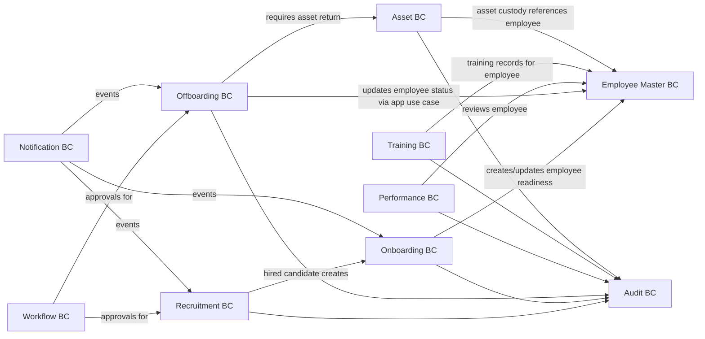

# Phase 3 DDD Domain Model Design — Talent Lifecycle

Version: 0.1  
Date: 2026-06-30  
Status: Draft for review

## 1. Introduction

### 1.1 Purpose

Defines the DDD model for Phase 3 (Talent Lifecycle): recruitment, onboarding, offboarding, performance, training, and asset management.

### 1.2 Scope

Phase 3 builds lifecycle domains around the Phase 1 Employee Master and Phase 2 Workflow/Notification contexts.

References:

- `docs/srs/03-talent-lifecycle-srs.md`
- `docs/superpowers/specs/2026-06-30-phase1-ddd-domain-model.md`
- `docs/superpowers/specs/2026-06-30-phase2-ddd-domain-model.md`

## 2. Strategic Design

### 2.1 Subdomain Classification

| Subdomain | Type | Rationale |
| --- | --- | --- |
| Recruitment | Supporting | Important, but pipeline patterns are standard. |
| Onboarding | Supporting | Cross-team readiness workflow. |
| Offboarding | Supporting | Compliance and clearance workflow. |
| Performance | Supporting/Core-adjacent | Business-sensitive, may grow into core later. |
| Training | Generic/Supporting | Catalog + enrollment + result tracking. |
| Asset | Generic/Supporting | Inventory/custody tracking. |

### 2.2 Bounded Context Map



## 3. Recruitment BC

Aggregates:

- `RecruitmentRequisition`
- `Candidate`
- `Interview`
- `Offer`

### RecruitmentRequisition

Key attributes: `id`, `department_id`, `position_id`, `headcount`, `reason`, `status`, `workflow_request_id`, `opened_at`, `closed_at`.

Invariants:

- Approved requisition required before opening hiring pipeline, unless override permission exists.
- Closed requisitions cannot accept new candidates.

### Candidate

Key attributes: `id`, `full_name`, `email`, `phone`, `source`, `cv_file_descriptor`, `status`, `applications[]`.

Invariants:

- Duplicate candidate detection uses email/phone identity keys.
- Candidate PII follows privacy controls.

### Interview

Key attributes: `candidate_id`, `requisition_id`, `interviewers[]`, `scheduled_at`, `status`, `scorecards[]`.

Invariants:

- Scorecards are immutable after submitted except privileged correction.

### Offer

Key attributes: `candidate_id`, `requisition_id`, `terms`, `status`, `accepted_at`, `rejected_at`.

Invariants:

- Candidate conversion requires accepted offer.

Domain events: `RequisitionApproved`, `CandidateAdded`, `InterviewScheduled`, `ScorecardSubmitted`, `OfferAccepted`, `CandidateHired`.

Repositories: requisition, candidate, interview, offer.

## 4. Onboarding BC

Aggregates:

- `OnboardingTemplate`
- `OnboardingPlan`
- `OnboardingTask`

### OnboardingTemplate

Defines reusable task sets by department, position, branch, or employment type.

### OnboardingPlan

Key attributes: `employee_id`, `candidate_id`, `template_id`, `start_date`, `status`, `tasks[]`.

Invariants:

- Mandatory tasks must complete or be waived before plan completion.
- Completion does not directly mutate Employee aggregate; it emits event/use case.

### OnboardingTask

Key attributes: `owner_type`, `owner_id`, `task_type`, `due_date`, `status`, `proof_file_descriptor`.

Domain events: `OnboardingPlanCreated`, `OnboardingTaskCompleted`, `OnboardingCompleted`.

Repositories: template, plan, task.

## 5. Offboarding BC

Aggregates:

- `OffboardingRequest`
- `OffboardingPlan`
- `OffboardingTask`
- `FinalClearance`

### OffboardingRequest

Key attributes: `employee_id`, `reason`, `requested_last_working_date`, `approved_last_working_date`, `status`, `workflow_request_id`.

Invariants:

- Approved leaving date required before final clearance.

### OffboardingPlan

Task plan for HR, manager, IT, admin, accounting, and employee.

Invariants:

- Mandatory clearance tasks must complete or be waived.
- Asset return obligations are checked before final clearance.

### FinalClearance

Key attributes: `employee_id`, `offboarding_plan_id`, `cleared_at`, `cleared_by`, `final_payroll_notes`.

Domain events: `OffboardingRequested`, `OffboardingApproved`, `OffboardingTaskCompleted`, `FinalClearanceCompleted`.

Repositories: request, plan, task, final clearance.

## 6. Performance BC

Aggregates:

- `PerformanceCycle`
- `PerformanceReview`
- `Goal`
- `CompetencyTemplate`

### PerformanceCycle

Defines review period, population, workflow, scoring rules.

Invariants:

- Active cycle configuration is locked after reviews start.

### PerformanceReview

Key attributes: `employee_id`, `cycle_id`, `self_assessment`, `manager_assessment`, `score`, `status`, `finalized_at`.

Invariants:

- Weight totals must satisfy scoring policy.
- Finalized reviews are immutable except privileged correction.

Domain events: `PerformanceCycleStarted`, `SelfAssessmentSubmitted`, `ManagerReviewSubmitted`, `PerformanceReviewFinalized`.

Repositories: cycle, review, goal, competency template.

## 7. Training BC

Aggregates:

- `TrainingCourse`
- `TrainingSession`
- `TrainingEnrollment`
- `TrainingResult`

Invariants:

- Enrollment capacity cannot exceed session capacity unless override exists.
- Completion result references an enrollment.

Domain events: `TrainingSessionScheduled`, `EmployeeEnrolled`, `TrainingAttendanceRecorded`, `TrainingCompleted`.

Repositories: course, session, enrollment, result.

## 8. Asset BC

Aggregates:

- `AssetItem`
- `AssetAssignment`
- `AssetReturn`

### AssetItem

Key attributes: `asset_code`, `asset_type`, `serial_number`, `condition`, `status`.

### AssetAssignment

Key attributes: `asset_id`, `employee_id`, `issued_at`, `expected_return_at`, `condition_on_issue`, `status`.

Invariants:

- An asset cannot be actively assigned to more than one employee.
- Offboarding cannot clear while mandatory asset returns are pending.

### AssetReturn

Records return condition, damage/loss, and settlement notes.

Domain events: `AssetAssigned`, `AssetReturned`, `AssetLost`, `AssetDamaged`.

Repositories: asset item, assignment, return.

## 9. Application Layer Shape

Use cases:

- `CreateRecruitmentRequisition`
- `ApproveRequisition`
- `AddCandidate`
- `ScheduleInterview`
- `SubmitScorecard`
- `SendOffer`
- `AcceptOffer`
- `ConvertCandidateToEmployee`
- `CreateOnboardingPlan`
- `CompleteOnboardingTask`
- `CompleteOnboardingPlan`
- `RequestOffboarding`
- `ApproveOffboarding`
- `CompleteOffboardingTask`
- `CompleteFinalClearance`
- `StartPerformanceCycle`
- `SubmitSelfAssessment`
- `SubmitManagerReview`
- `ScheduleTrainingSession`
- `EnrollEmployeeInTraining`
- `AssignAsset`
- `ReturnAsset`

## 10. Cross-Context Flow

Hire flow:

```text
Requisition approved
  -> Candidate progresses through interviews
  -> Offer accepted
  -> CandidateHired event
  -> Employee profile created/linked
  -> OnboardingPlan created
```

Exit flow:

```text
Offboarding approved
  -> Tasks assigned
  -> Assets returned
  -> Final clearance completed
  -> Employee status change requested
```

## 11. Acceptance

Phase 3 DDD model is accepted when:

1. Hire-to-employee and exit-to-archive flows are explicit.
2. Recruitment never owns Employee Master data.
3. Onboarding/Offboarding mutate Employee only through application use cases/events.
4. Performance reviews are protected from casual mutation after finalization.
5. Asset obligations integrate with offboarding clearance.
