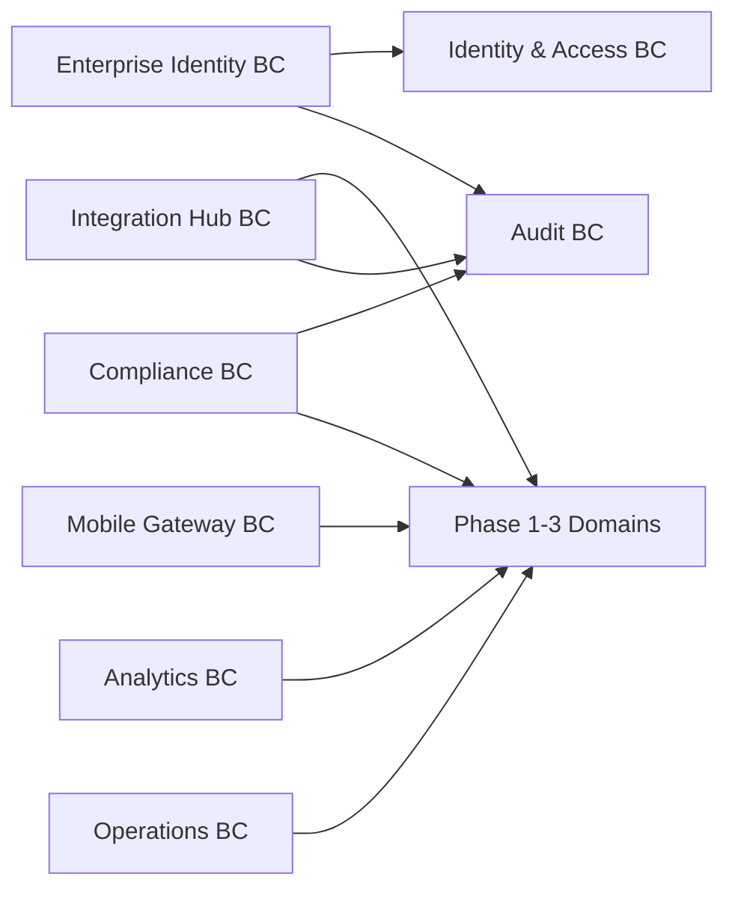

# Phase 4 DDD Domain Model Design — Enterprise Extensions

Version: 0.1  
Date: 2026-06-30  
Status: Draft for review

## 1. Introduction

### 1.1 Purpose

Defines the DDD model for Phase 4 (Enterprise Extensions): SSO, advanced integrations, mobile readiness, analytics, compliance, and scale hardening.

### 1.2 Scope

Phase 4 adds control-plane and extension contexts around existing Phase 1–3 domains. It does not redefine core HR aggregates.

References:

- `docs/srs/04-enterprise-extensions-srs.md`
- `docs/superpowers/specs/2026-06-30-phase1-ddd-domain-model.md`
- `docs/superpowers/specs/2026-06-30-phase2-ddd-domain-model.md`
- `docs/superpowers/specs/2026-06-30-phase3-ddd-domain-model.md`

## 2. Strategic Design

### 2.1 Subdomain Classification

| Subdomain | Type | Rationale |
| --- | --- | --- |
| Enterprise Identity | Supporting | Extends IAM with SSO/MFA/session governance. |
| Integration Hub | Supporting | Connects HRM to external systems safely. |
| Mobile Gateway | Generic/Supporting | API/client adaptation layer. |
| Analytics | Supporting | Executive insight, mostly read-side modeling. |
| Compliance | Supporting | Retention, masking, audit evidence. |
| Operations | Generic | Job visibility, archival, DR controls. |

### 2.2 Bounded Context Map

## 3. Enterprise Identity BC

Aggregates:

- `IdentityProvider`
- `FederatedIdentity`
- `MfaPolicy`
- `SessionControl`

### IdentityProvider

Key attributes: `provider_type`, `issuer`, `client_id`, `mapping_rules`, `active`.

Invariants:

- Only active provider can authenticate.
- Secrets live in secrets manager, not domain entity.

### FederatedIdentity

Maps external subject to local user.

Invariants:

- One external subject maps to one local user.

Domain events: `SsoProviderEnabled`, `FederatedLoginSucceeded`, `FederatedLoginFailed`, `MfaRequired`, `SessionRevoked`.

Repositories: identity provider, federated identity, MFA policy, session control.

## 4. Integration Hub BC

Aggregates:

- `IntegrationEndpoint`
- `IntegrationCredential`
- `IntegrationJob`
- `WebhookSubscription`

### IntegrationEndpoint

Defines external system type, direction, transport, and active state.

### IntegrationCredential

Stores credential metadata only; secret material stays outside domain.

### IntegrationJob

Key attributes: `endpoint_id`, `job_type`, `payload_reference`, `status`, `attempt_count`, `last_error`.

Invariants:

- Retries are bounded.
- Failed integration job cannot corrupt source domain transaction.

### WebhookSubscription

Defines outbound event delivery rules.

Domain events: `IntegrationJobQueued`, `IntegrationJobSucceeded`, `IntegrationJobFailed`, `WebhookDelivered`, `WebhookDeliveryFailed`.

Repositories: endpoint, credential, job, webhook subscription.

## 5. Mobile Gateway BC

Aggregates:

- `MobileDevice`
- `MobileSession`
- `PushSubscription`

This BC adapts existing APIs for mobile and manages device/session/push concerns. It does not duplicate HR business logic.

Invariants:

- Mobile access follows same permission/data-scope rules as web.
- Lost/revoked devices cannot receive push or access APIs.

Domain events: `MobileDeviceRegistered`, `MobileDeviceRevoked`, `PushSubscriptionUpdated`.

Repositories: mobile device, session, push subscription.

## 6. Analytics BC

Aggregates:

- `MetricDefinition`
- `DashboardDefinition`
- `AnalyticsSnapshot`
- `AnalyticsReportRun`

Analytics is read-model heavy. It owns derived metrics, not source-of-truth HR facts.

Invariants:

- Drill-down respects source data-scope rules.
- Large calculations are async.
- Snapshots declare source period and generation time.

Domain events: `AnalyticsSnapshotGenerated`, `AnalyticsReportRunCompleted`, `AnalyticsReportRunFailed`.

Repositories: metric definition, dashboard definition, snapshot, report run.

## 7. Compliance BC

Aggregates:

- `RetentionPolicy`
- `MaskingPolicy`
- `AuditEvidencePackage`
- `DataExportRequest`

### RetentionPolicy

Defines retention and archival rules for record classes.

### MaskingPolicy

Defines when salary, tax, identity, bank, or health fields are masked.

### AuditEvidencePackage

Bundles audit logs, exports, and business records for compliance review.

### DataExportRequest

Controls sensitive export requests.

Invariants:

- Sensitive export requires permission and audit trail.
- Retention policy cannot delete records still needed by locked payroll or legal hold.

Domain events: `RetentionPolicyChanged`, `MaskingPolicyChanged`, `SensitiveExportRequested`, `AuditEvidencePackageGenerated`.

Repositories: retention policy, masking policy, evidence package, export request.

## 8. Operations BC

Aggregates:

- `BackgroundJobMonitor`
- `ArchiveBatch`
- `BackupRun`
- `DisasterRecoveryDrill`

Operations BC models platform operation evidence, not business logic.

Invariants:

- Archive jobs must be reversible or verified before finalization.
- Backup runs record result and restore evidence.

Domain events: `ArchiveBatchStarted`, `ArchiveBatchCompleted`, `BackupRunCompleted`, `DisasterRecoveryDrillCompleted`.

Repositories: job monitor, archive batch, backup run, DR drill.

## 9. Application Layer Shape

Use cases:

- `EnableIdentityProvider`
- `MapFederatedIdentity`
- `RevokeUserSessions`
- `RegisterIntegrationEndpoint`
- `RunIntegrationJob`
- `DeliverWebhook`
- `RegisterMobileDevice`
- `RevokeMobileDevice`
- `GenerateAnalyticsSnapshot`
- `GenerateExecutiveReport`
- `CreateRetentionPolicy`
- `CreateMaskingPolicy`
- `RequestSensitiveExport`
- `GenerateAuditEvidencePackage`
- `RunArchiveBatch`
- `RecordBackupRun`
- `RecordDisasterRecoveryDrill`

## 10. Cross-Context Principles

- Phase 4 contexts extend existing contexts; they do not own Employee, Payroll, Attendance, or Recruitment facts.
- Integration Hub uses events and APIs, not direct table mutation.
- Analytics uses snapshots/read models, not operational write models.
- Compliance uses policy + audit evidence, not ad hoc exports.
- Mobile Gateway reuses existing API authorization and data-scope logic.

## 11. Acceptance

Phase 4 DDD model is accepted when:

1. SSO/MFA extends IAM without duplicating IAM aggregates.
2. Integrations are isolated from core transaction integrity.
3. Mobile does not duplicate business logic.
4. Analytics owns derived metrics only.
5. Compliance controls sensitive data access/export/retention.
6. Operations records evidence for backup, archive, and DR processes.
